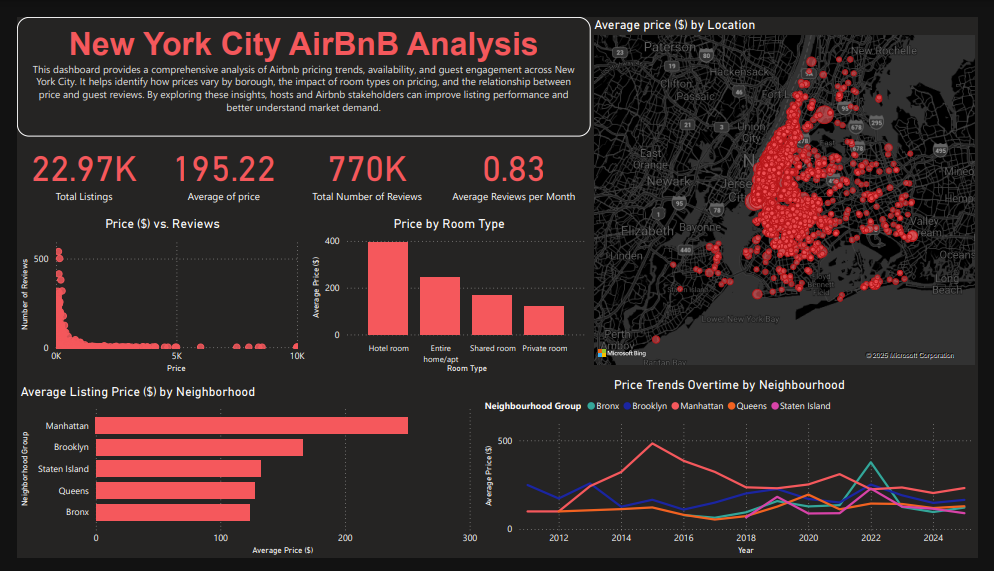

# NYC Airbnb Price Analysis
## Executive Summary

This analysis focuses on Airbnb pricing trends and listing reviews across New York City. The insights aim to assist Airbnb stakeholders, including hosts and investors, to refine pricing strategies and improve listing performance.

### Key Findings

- **Borough Pricing Trends**: Manhattan commands the highest average prices across the boroughs, with the Bronx offering the most affordable options.
- **Accommodation Types**: Hotel rooms and entire homes are priced at premium rates, while private and shared rooms are more economical, catering to budget travelers.
- **Seasonal Price Fluctuations**: There are notable variations in pricing over time, with significant peaks observed in specific periods. For example, the year 2022 saw a spike in prices across listings in the Bronx, Brooklyn, and Staten Island.
- **Price vs. Reviews**: Listings with higher prices tend to garner fewer reviews, indicating that more affordable listings are more frequently reviewed, suggesting that affordability may influence guest engagement.

### Conclusion & Recommendations
- **Optimize Pricing**: Listings under $500 receive more engagement, making them more attractive to guests.
- **Target Budget Travelers**: Hosts in Queens, Bronx, and Staten Island can attract price-sensitive guests.
- **Luxury Listings Need Unique Value Propositions**: High-end Airbnb stays should enhance guest experience to justify premium pricing and increase listing reviews.
- **Use Seasonal Pricing Models**: Adjust rates based on historical price trends and demand fluctuations.

### If you have suggestions for enhancing the code or the project overall, please feel free to open an issue or submit a pull request. Your contributions are greatly appreciated!
